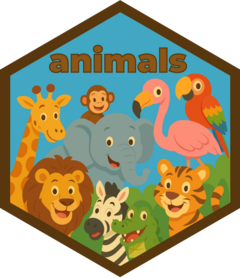

<!-- README.md is generated from README.Rmd. Please edit that file -->

```{r, include = FALSE}
knitr::opts_chunk$set(
  collapse = TRUE,
  comment = "#>",
  fig.path = "man/figures/README-",
  out.width = "100%"
)
```

# animals 

<!-- badges: start -->
<!-- badges: end -->

The goal of animals is to provide a small dataset for text classification and regression tasks.

## Installation

You can install the package with:

``` r
# install.packages("devtools")
devtools::install_github("EmilHvitfeldt/animals")
```

This package will most likely never be put on CRAN.

## Example

```{r example}
library(animals)
library(tibble)
glimpse(animals)
```
